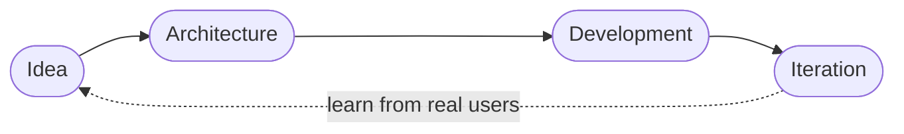
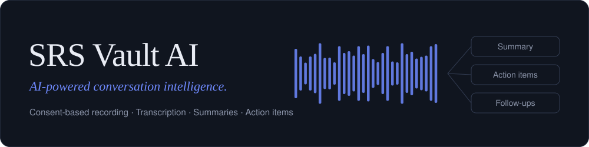

  

 

**Founder · Product Builder · Software Developer**

I build technology products across **AI, commerce, startup ecosystems, and software engineering**. 
From defining the product and designing the experience to building the technology and taking it to real users.

 

## What I do

| Focus | What it means |
| :--- | :--- |
| **Build products** | From idea to architecture, development and iteration |
| **Build startups** | Exploring products around AI, commerce and technology ecosystems |
| **Software development** | Web, mobile, APIs and databases |
| **AI product development** | Exploring practical applications of AI |
| **Product engineering** | Connecting business problems with technical solutions |
| **Continuous learning** | DSA, system design, architecture and modern development |

 

## How a product gets built

 

## Products I'm building

Monterus X is a startup ecosystem designed around **startups, investors, advertisers, creators, and developers**. The vision is a digital place where startups can discover the right people, build visibility, access growth opportunities and form stronger connections.

`Startup Discovery` · `Investors` · `Advertising` · `Creators` · `Developers` · `Data` · `Wallet Infrastructure` · `Growth`

 

SRS Vault AI transforms conversations into structured, actionable intelligence. The goal is to help people **understand conversations, remember important discussions, and turn them into meaningful actions.**

`Consent-based recording` · `AI transcription` · `AI summaries` · `Action items & follow-ups` · `Conversation analysis` · `Contact-specific history` · `Conversation preparation` · `Personalized communication insights`

 

Niklit is a hyperlocal delivery app, built around what is close to you.

 

## Always learning

     

 

### Building something? Let's talk.

